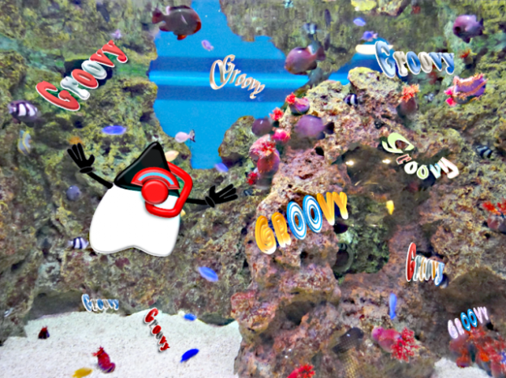
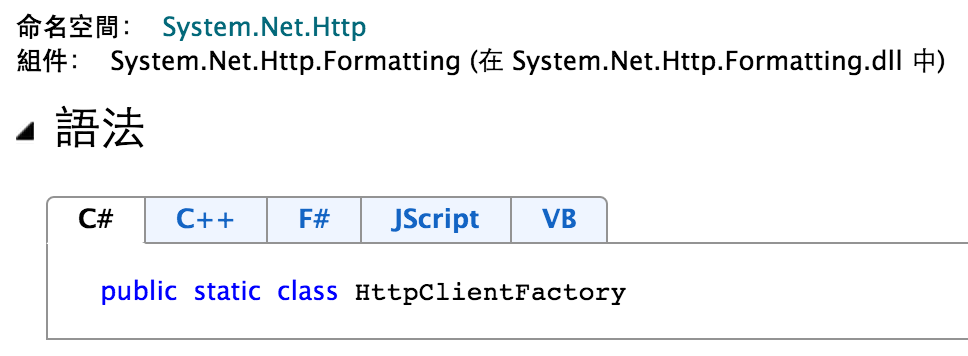

# Groovy Tutorial（1）認識 Groovy 的第一課 #



> Groovy - very good and enjoyable programming language

查詢韋氏字典（Merriam-Webster），可以發現 Groovy 單字的[定義](http://www.merriam-webster.com/dictionary/groovy)是「*very good and enjoyable*」。學習 Groovy 程式語言的過程中，可以發掘許多 Groovy 帶來的樂趣，並且能夠用它輕鬆完成許多任務。

Groovy 程式語言在 2003 年問世，創造它的是 Apache Software Foundation 的軟體工程師 [James Strachan](http://people.apache.org/~jstrachan/)，目前專案的負責人則是 [Guillaume LaForge](http://glaforge.appspot.com/)。Groovy 是自由軟體，它採用 Apache 2.0 開放原始碼授權，第一個正式版本 1.0 在 2007 年發佈，從 2012 年發佈 2.0 版本後，Groovy 的發展更活躍，預期在 2014 年就會出現 3.0 的新版本。

長久以來，許多 Java 開發者期待更好的語言，[Java.next](http://www.ibm.com/developerworks/opensource/library/j-jn1/index.html) 一直是受到關注的議題。日漸成熟的 Groovy 帶來新希望，它讓開發 Java 的世界變得更加敏捷，我們不必再等待 Java 8 或 Java 9 實現的新功能，有許多現代語言的方便特性，開始用 Groovy 就能做到。

Groovy 的語法大致上和 Java 語言相似；但是卻比 Java 更容易學習與使用，也比更適合剛入門學習寫程式的初學者。已經熟悉 Java 的開發者，很快就能學會使用 Groovy 寫程式，有許多用 Java 寫起來很複雜的程式，改用 Groovy 就可以用更輕鬆簡單的方法完成，因此吸引不少 Java 開發者加入學習行列。

## A First Look at Groovy ##

Groovy 可以當作 Scripting Language 執行，不必像 Java 至少需要定義主類別（Main-Class）與 ``main(String[] args)`` 方法提供主程式才能啟動。因此最簡單的 Hello World 程式用 Groovy 撰寫只需要一行，就像 Python 或 Ruby 這類語言一樣簡單易寫。

    println "Hello Groovy" 

Groovy 是物件導向程式語言（Object-Oriented Programming Language），假如我們要定義一個 Person 類別，包含 name 與 age 兩個屬性，並且在物件建構時以參數指派屬性的初值，可以用很簡單的程式碼完成：

```
class Person {
    def name, age
}

def p = new Person(name: 'John', age: 21)
println "${p.name}: ${p.age}"
```

這段 Groovy 程式碼很容易就能理解，並不需要多做解釋；即使從來沒有學過 Groovy 語言，大概也能猜出每一行程式碼的用意。

但是相同的程式若改用 Java 撰寫，事情就會變得複雜許多。現在的 Java 已發展成過度工程導向（over-engineered）的程式語言，有著初學者不容易跨越的學習門檻。

Person.java

```
public class Person {

    private String name;
    private int age;
    
    public Person(String name, int age) {
        this.name = name;
        this.age = age;
    }
    
    public String getName() {
    	return name;
    }
    
    public int getAge() {
    	return age;
    }
    
    public static void main(String[] args) {
        Person p = new Person("John", 21);
        System.out.printf("%s: %d\n", p.name, p.age);
    }
}
```

對學習者而言，入門 Groovy 比 Java 更容易，特別是剛開始接觸物件導向程式設計時，不必被又多又規則複雜的關鍵字混淆，較能專注在物件導向觀念的學習。如果是從 Groovy 開始入門，未來要學習 Java 程式設計並不難，使用 Java API 的方法也沒有什麼不同，只是 Java 寫起來就是比較麻煩一些。

Groovy 簡化字串的操作，可以類似 PHP 在使用雙引號「`"`」的字串中夾帶變數。

	println "現在月份：${new Date().month}"
	println "Square root of 199 is ${Math.sqrt(199)}"
	println "運動強度建議每分鐘心跳數不超過 ${(220 - p.age) * 0.9}"

遇到多行內容的字串也可以很容易設計。

```
mailContent = """Dear ${p.name},

Welcome to a world of Peace, Love and Grooviness!

Best regards,
Kyle
${new Date().format('yyyy/MM/dd')}
"""
```

## Functioanl Programming ##

函數型程式設計（Functional Programming，簡稱 FP）在 Java 世界不多見，過去的做法通常搭配 Funcation Library（如 [Functional Java](http://functionaljava.org/)）使用。JDK 直到最新的 Java SE 8 推出，才有提供 [Lambda Expression](http://docs.oracle.com/javase/tutorial/java/javaOO/lambdaexpressions.html) 的支援，但是卻使得觀念變得更多更複雜。在傳統的 Java 物件導向程式中，撰寫函數型的程式並不自然，也不容易學習或實際應用。

Groovy 提供 Lambda 及 Closure 的特性，可以支援函數型程式設計。在撰寫 Groovy 程式時，使用 FP 很自然而且也很容易寫，開發者可以適時運用來「簡化」程式碼，而不是把程式碼變得更複雜。

例如一個比較兩個數字大小的程式，可以撰寫成多數人都熟悉的函式宣告形式。

```
def max(a, b) {
    a > b ? a : b
}

max(18, 24)  // return 24  
```

但是在 Groovy 可以寫成 Closure 形式，有點類似 JavaScript 的匿名函式（anonymous function）。

```
def max = { a, b ->
    a > b ? a : b
}

max(35, 24)  // return 35  
```

Closure 讓程式碼可以被當成資料（code as data），開發者可以更靈活地撰寫不同風格的 Groovy 程式碼。

```
def max = { a, b ->
    a > b ? a : b
}

def min = { a, b ->
    a < b ? a : b
}

[max, min].each {
    println it(2013, 2014)
}

func = "max"
"${func}"(1024, 768) // return 1024
```

## Data Structure ##

Map 與 List 是 Java 程式常用的資料結構，但是遇到很簡單的資料處理時，Java 程式碼並無法像 PHP 或 Ruby 那樣簡潔。Groovy 的語法內建 Map 與 List 兩種資料結構，讓簡單的資料處理能有易讀易寫的做法。

宣告 List 的語法很像定義陣列。

```
list1 = []
```

上面這行程式碼等同於「`list1 = new ArrayList()`」

```
list1.class.name // => java.util.ArrayList
```

Groovy 讓 List 的操作更簡化，使用運算子也比較直覺。

```
list1 = [1, 2]
list1 += [3, 4, 5]
list1 << 6

list1.size() // => 6

list1 == [1, 2, 3] + [4, 5, 6] // => true

list1.each {
    println it
}
```

如果 List 的內容是連續數字（或字元），使用 Range 語法產生 List 更方便，Range 的語法是 `N1..N2` 用來表示一個 N1 到 N2 的範圍。

```
list1 = 1..5
list2 = [1, 2, 3, 4, 5]

list1 == list2 // => true
```

因此從 1 數到 100 或者從 a 數到 z 的程式，用 Range 撰寫的程式碼看起來相當簡短。

```
(1..100).each { println it }
('a'..'z').each { println it }
```

再來是 Map 的使用方式，以下是建立 Map 的語法。

```
map1 = [:]
```

Groovy 操作 Map 的程式碼也是很符合直覺，相當容易就能理解。

```
map1 = [name: "book1", year: 2010]

map1['name'] = "book1 2e"
map1.year = 2013
map1 << [author: "John"]

map1.each { key, value ->
    println "${key} = ${value}"
}
```

## Domain Specific Language ##

Groovy 適合用於多種類型的軟體開發，包括桌面視窗程式、網路服務程式、網站或資料庫應用程式等。

以打造圖形介面（視窗）應用程式為例，Groovy 可以使用 Java 的 Swing GUI Toolkit，以下是使用 Groovy 撰寫的 Swing Hello World 範例。

```
import javax.swing.*

frame = new JFrame("HelloWorldSwing")
label = new JLabel("Hello World")
frame.contentPane << label
frame.pack()
frame.visible = true
```

若是將「使用 Swing API 設計 GUI 介面」視為一種應用領域（domain），領域描述語言（Domain Specific Languages，簡稱 DSL）就是為這個領域設計專門的語言。設計新語言聽起來似乎大費周章，但是在 Groovy 的世界，我們將會經常使用 DSL 設計程式。

瞭解 DSL 不能錯過 Martin Fowler 大師的經典著作「[Domain Specific Languages](http://martinfowler.com/books/dsl.html)」，也許你早已知道 DSL 的美好，卻不知道怎麼實際應用它。

從學習 Groovy 的那一刻起，就會開始不斷與 DSL 打交道。Groovy 有許多不同用途的 Builder，讓你輕鬆享受 DSL 帶來的好處。

常見的 Groovy Builder 包括：

* groovy.json.JsonBuilder
* groovy.xml.MarkupBuilder
* groovy.swing.SwingBuilder
* groovy.util.AntBuilder

我們可以將 Swing Hello World 範例程式改用 SwingBuilder 重寫成 DSL 的風格。

```
new groovy.swing.SwingBuilder().edt {
    frame(title: "HelloWorldSwing", pack: true, show: true) {
        label(text: "Hello World")
    }
}
```

利用 DSL 風格的 Builder 寫程式，讓程式碼更易讀也更易寫，可以讓程式設計師的生產力倍增。舉例來說，在 Groovy 程式產生 JSON 輸出，可以使用 ``JsonBuilder`` 輕鬆完成。

```
def builder = new groovy.json.JsonBuilder()
builder.people {
    person {
        firstName 'Kyle'
        lastName 'Lin'
        address(
            city: 'Taichung',
            country: 'Taiwan'
        )
    }
}

println builder.toPrettyString()
```

## Metaprogramming ##

Groovy 支援靜態語言不容易做到的 Metaprogramming 功能，利用 ``metaClass`` 我們可以擴充一個已經定義好的類別，加入新的方法函式。

例如基本的 Java API 的 String 類別，我們可以加入 String 的 ``hello()`` 方法，讓字串直接擁有新的功能。

```
String.metaClass.hello = { "Hello ${delegate}" }
"John".hello()  // Say Hello to John
```

許多常用的 Java API 類別，例如 String 與 URL 等，Groovy 提供功能更強的版本，讓我們在撰寫程式碼時，能夠使用更簡單的方式完成任務。

```
// Execute external command and get results
execResult = "echo hello".execute().text

// Fetch html response from a url
htmlText = new URL("http://google.com/").text
```

修改已經定義好的類別，也可能帶來一些危險。但是 Groovy 提供 Metaprogramming 讓開發者有更多選擇，在適當的時候可以派上用場。

舉例來說，如果在程式經常要處理 HTML 文字，讓字串直接擁有 Escape HTML 的能力，就能擁有一個更符合應用領域需求的語言。

```
String.metaClass.escapeHtml = {
  delegate
  .replaceAll('<', '&lt;')
  .replaceAll('>', '&gt;')
  .replaceAll(' ', '&nbsp;')
}

"<br />".escapeHtml()
```

## Java 的美麗與哀愁 ##

TIOBE 提供程式語言熱門程度的排行榜，從這份統計資料不難發現 Java 始終名列前茅。

[TIOBE Programming Community Index](http://www.tiobe.com/index.php/content/paperinfo/tpci/index.html)

Java 不僅有眾多 Open Source 社群開發者的支持，也有多家跨國大型軟體公司力挺，形成的 Ecosystem 難以被其他開發平台取代；我們可以大膽預期 Java 在未來幾年仍會有舉足輕重的地位，在 Web-based 及 Cloud 應用成為主流的今日，Java 會在 Server-side 的開發扮演重要的角色。

從 1995 年誕生迄今，Java 已算是個邁入中年的程式語言，它被廣泛使用於各類型軟體開發，發展出豐富的 Java API 及大量的 Library 與 Framework，Java 的解決方案多能滿足企業級的開發需求。

傳統的 Java 語言已經變得太過複雜；但儘管許多開發者渴望更時髦的 Java 語言，多年來一直無法如願以償，歷史的包袱使得 Java 語言不可能快速演化。如果期望有一天寫 Java 也能夠像 Ruby 或 Python 同樣愉悅，那肯定是在夢境裡才會實現。

Groovy 誕生的那一刻，已經為 Java 的世界重新打開一扇窗。

Groovy 受到其他程式語言的啟發，將許多語言的優點融合，像是 Smalltalk、Ruby 或 Python 等，甚至可以像 Perl 一樣直接在程式碼使用 Regular Expression。

```
new File('.').eachFileMatch( ~/.*\.groovy/ ) {
    println it
}
```

使用 Groovy 能享有其他現代語言的便利特性，但同時又能與既有的 Java 知識相輔相成，有大量豐富的開發資源倚靠，這是許多 Java 程式設計習武之人夢寐以求的事。

## Polyglot Programming in the JVM ##

原來 Java 的世界不只有 Java 程式語言！？

先談談什麼是 Polyglot Programming 吧？

以微軟的 .NET 開發平台為例，MSDN 文件提供 C# / C++ / F# / JScript / VB 等五種不同語言的使用範例。雖然使用不同的程式語言撰寫，但它們都使用相同的 .NET Framework API。



Java 虛擬機器（Java Virtual Machine，簡稱 JVM）的設計亦支援 Polyglot Programming，不管用什麼語言寫程式，只要編譯成 Java Bytecode，就可以在 JVM 虛擬機器執行。

官方的 Java API 文件中，無法找到其他程式語言的範例，坊間一般的書籍也很少介紹 JVM 的其他語言。但實際上 Java 世界用其他語言寫程式，已盛行多年並且可用於產品的開發。

常見的 JVM Languages 包括：

* Groovy
* Clojure
* Scala
* JRuby
* Jython
* Rhino
* ⋯還有更多。

Polyglot Programming 帶給 Java 程式設計師更多的語言選擇，例如「使用 JavaScript 撰寫 Java 程式」，下面的範例是一段 JavaScript 程式碼，它使用 Java Thread API 建立多執行緒。

```
var obj = {
    run: function () { 
      print(“Hello Thread\n"); }
}
var r = new java.lang.Runnable(obj);
var t = new java.lang.Thread(r);
t.start();
```

（註：這段 JavaScript 程式碼需要使用 Rhino 執行，無法在瀏覽器中執行。）

## JVM Scripting Language ##

Ousterhout's dichotomy 將程式語言分類為以下兩種：

系統程式語言（System Programming Language）

* 靜態型別
* 可支援建立複雜資料結構
* 程式被編譯成機器碼

腳本語言（Scripting Language）

* 動態型別
* 較不適合複雜資料結構
* 程式以直譯方式執行

（[Oursterhout, 1998](http://en.wikipedia.org/wiki/Ousterhout's_dichotomy)，資料來源為 Wikipedia）

Groovy 兼顧上述兩種不同語言的特性，既可當作 Scripting Language 用直譯方式執行，也可以先編譯 Groovy 的類別程式碼變成 Java Bytecode；後者的執行方式和一般 Java Class 相同，也可以打包成 JAR 或 WAR 發佈。

Java Scripting API 最早是從 Java SE 6 這個版本開始提供，它提供 ScriptEngine 介面類別，讓不同的 JVM Scripting Language 有一致的執行方式，以下是使用 ScriptEngine 執行 JavaScript 程式碼的範例。

```
ScriptEngineManager factory = new ScriptEngineManager();
ScriptEngine engine = factory.getEngineByName("JavaScript");
engine.eval("print('Hello');");
```

我們這邊所談的 Java Scripting 並非 Java Script，而是指可以在 JVM 以 Scripting 方式執行的各種語言。

但是 Java Script 是 JDK 6 唯一內建支援的語言，JDK 並沒有提供 Groovy 或其他 JVM Scripting Language 的 ScriptEngine 實作。若要執行其他語言的 Scripting 程式碼，需要先將符合 JSR-223 規範的 Library 加到 CLASSPATH 才能執行。

以下是 ScriptingEngine 執行 Groovy Scripting 程式碼的 Java 程式範例，執行前需要先取得 [groovy-all-2.2.1.jar](http://repo1.maven.org/maven2/org/codehaus/groovy/groovy-all/2.2.1/groovy-all-2.2.1.jar) 檔案。

RunGroovy.java

```
import javax.script.*;

public class RunGroovy {
    public static void main(String[] args) throws Exception {
        ScriptEngineManager factory = new ScriptEngineManager();
        ScriptEngine engine = factory.getEngineByName("groovy");
        engine.eval("println 'Hello'");
    }
}
```

執行方法：

    javac RunGroovy.java
    java -cp '.:groovy-all-2.2.1.jar' RunGroovy

## Why Groovy? ##

目前在 Java 世界已經四處可見 Groovy 的實際應用，不用擔心這只是曇花一現或是趕流行的新語言。Groovy 的出現不是為了取代 Java，而是讓那些原本在 Java 不容易做到的事情，能夠利用 Groovy 來達成，開發社群使用 Groovy 的開發應用將會愈來愈多。

iReport 與 JasperReport 是功能強大的報表設計工具，它利用 Groovy 簡化報表製作時的程式撰寫；在處理報表資料顯示時，可以利用 Groovy Scripting 進行資料的運算處理。

[iReport Designer - Groovy](http://community.jaspersoft.com/wiki/ireport-designer-groovy)

Gradle 是新一代的 Java 專案自動化建置工具，它直接使用 Groovy Script 定義專案建置的各項任務，比起 Ant 或 Maven 採用 XML 格式的設定檔，Gradle 直接以程式碼撰寫設計建置流程讓功能更強大，Groovy DSL 的特性也讓 Gradle 設定檔看起來十分友善。

[Gradle The Enterprise Build Automation Tool](http://www.gradle.org/)

Gradle 目前也成為 Google 建議的 Android 專案建置工具。

[New Build System‎ > ‎Gradle Plugin User Guide](http://tools.android.com/tech-docs/new-build-system/user-guide)

Jenkins CI 是持續整合（Continuous Integration）的工具首選，它為軟體開發團隊提供二十四小時無休的專業管家服務，可以幫忙處理單元測試或每日自動化建置及發佈。Jenkins 提供的 Script Console 功能，就是利用 Groovy Script 進行遠端維護管理。

[Jenkins Script Console](https://wiki.jenkins-ci.org/display/JENKINS/Jenkins+Script+Console)

Spock Framework 提供以更簡潔的 Groovy 語法撰寫測試案例，可以用於 Java 或 Groovy 程式的單元測試。Spock 提供 Specification 的描述語言，讓開發者用 Groovy DSL 的方式定義測試規格。

[Spock Enterprise-ready Testing and Specification Framework](http://spockframework.org)

Geb 是非常好用的 Web UI Testing 工具，它讓開發者使用 Groovy 撰寫簡單的 Script 程式來操作瀏覽器，完成網站各項畫面或表單的模擬操作。Geb 利用類似 jQuery 的語法取得畫面的內容加以驗證，還能夠將網頁測試結果及畫面截圖保存。Geb 對瀏覽器的自動化操作實際是透過 Selenium WebDriver 完成，它利用 Groovy DSL 的特性讓 Test Script 的撰寫變得十分容易。

[Geb - Very Groovy Browser Automation](http://www.gebish.org/)

## 學習資源 ##

網站

* [Groovy 官方網站](http://groovy.codehaus.org/)
* [Guillaume Laforge's Blog](http://glaforge.appspot.com/)
* [Koans](http://groovykoans.org/) the missing groovy tutorial
* [Groovy Content on InfoQ](http://www.infoq.com/groovy)
* [Groovy Zone](http://groovy.dzone.com/)

JSR 223

* [Java Scripting Programmer's Guide](http://docs.oracle.com/javase/6/docs/technotes/guides/scripting/programmer_guide/)
* [JSR 223（Scripting for the Java Platform）](https://jcp.org/en/jsr/detail?id=223)
* [JSR 223 Scripting with Groovy](http://groovy.codehaus.org/JSR+223+Scripting+with+Groovy)

軟體

* Groovy [安裝程式下載](http://groovy.codehaus.org/Download)
* [Gradle](http://www.gradle.org/) - Build Automation Evolved
* [Grails) - Web Framework](http://grails.org/
* [Griffon](http://griffon.codehaus.org/) - Rich Application Framework inspired by Grails
* [GVM](http://gvmtool.net/) - the Groovy enVironment Manager

開發工具

* [IntelliJ IDEA - The Best Groovy IDE](http://www.jetbrains.com/idea/features/groovy.html)
* NetBeans IDE + [Groovy Support](https://netbeans.org/features/groovy/)
* Eclipse IDE + [Groovy Plugin](http://groovy.codehaus.org/Eclipse+Plugin)

雜誌

* [GroovyMag](http://www.groovymag.com/) - the magazine for Groovy and Grails developers!

書籍

* [Programming Groovy 2/e](http://pragprog.com/book/vslg2/programming-groovy-2), Dynamic Productivity for the Java Developer
* [Making Java Groovy](http://www.manning.com/kousen/), by Kenneth A. Kousen
* [Groovy in Action 2/e](http://www.manning.com/koenig2/)