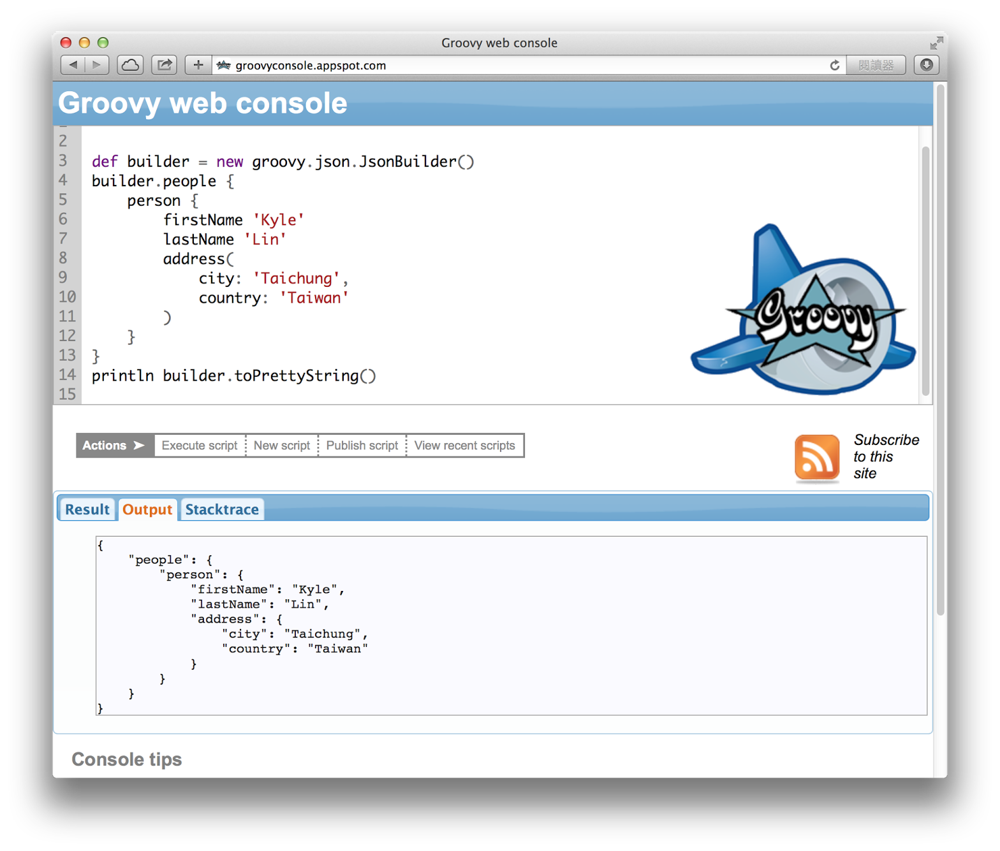
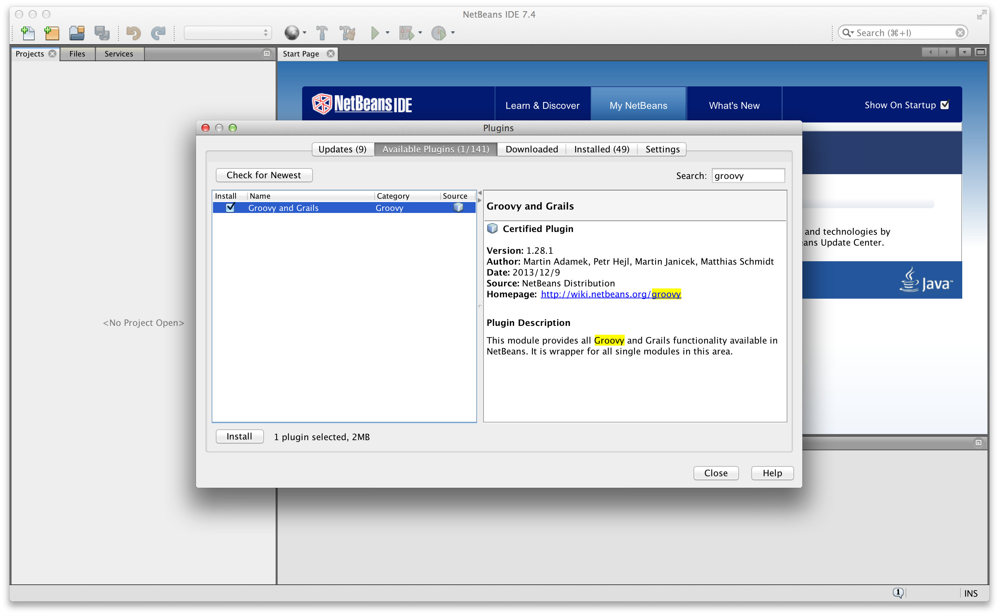
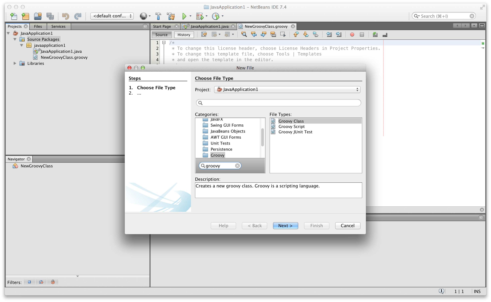
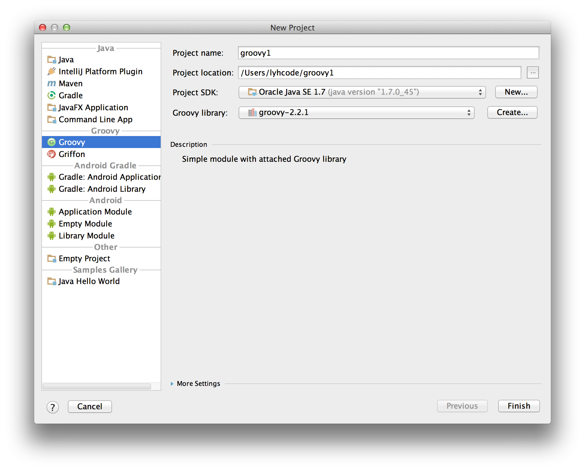
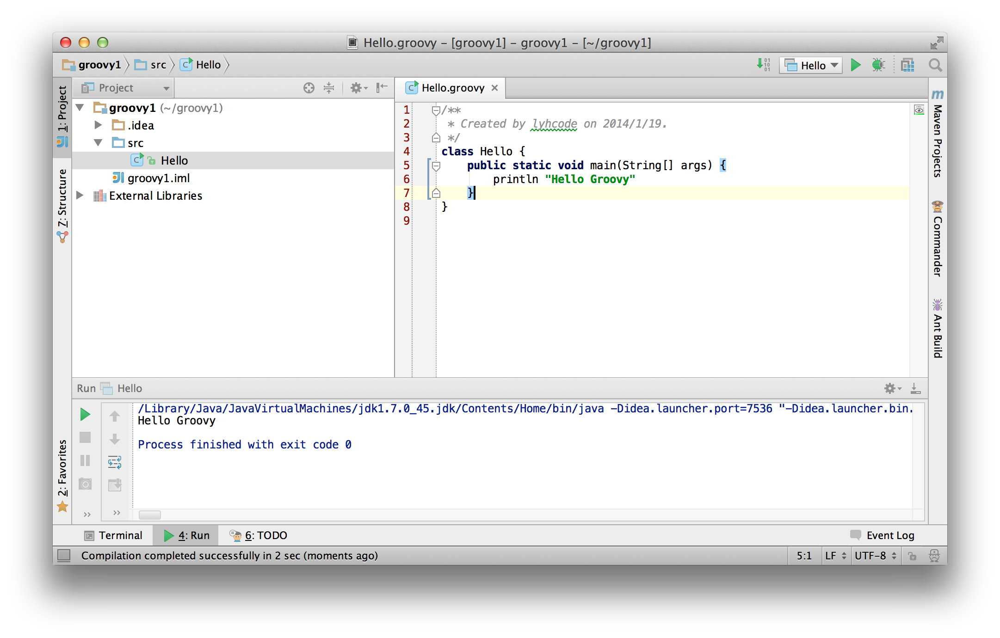

# Groovy Tutorial（2）軟體安裝與開發環境設定 #

安裝 Groovy 很容易，只要在 Groovy 的官方網頁下載最新的 Binary Release，解壓縮之後就能開始使用。如果使用 Windows 作業系統，Groovy 也提供自動安裝程式，可以更容易完成安裝步驟。

[Groovy 官方網站](http://groovy.codehaus.org/)

想要嘗試 Groovy 最新功能的開發者，可以從 Groovy 的專案網站取得完整的開放原始碼。

[Groovy 開放原始碼專案網站](http://groovy.codehaus.org/Git)

在不同作業系統上，Groovy 還有其他安裝方式可供選擇，以下會將安裝 Groovy 的各種經驗與讀者分享。

## 先安裝 JDK 軟體 ##

在開始安裝 Groovy 軟體之前，必須先確認電腦已經安裝 JDK（Java Development Kit）軟體。

因為 Groovy 程式碼需要編譯為 Java ByteCode 才能執行，所以必須安裝完整的 JDK 開發工具，不能只安裝 JRE（Java Runtime Environment）虛擬機器，再下載 Java 安裝程式時，必須留意是否正確下載 Development Kit 的完整 JDK 開發工具。

執行 Groovy 的最低需求是 Java SE 1.5 以上版本，但是該版本年代已經相隔久遠，建議使用最新穩定發行的版本，目前是 Java SE 1.7 Update 45。

[Download Java SE Development Kit](http://www.oracle.com/technetwork/java/javase/downloads/jdk7-downloads-1880260.html)

在安裝 JDK 之後必須設定 JAVA_HOME 環境變數，將其內容正確設定為 JDK 安裝路徑。

例如 Windows 系統的 JDK 安裝路徑是：

* `C:\Program Files\Java\jdk1.7.0_45`

可以在環境變數中，加上 JAVA_HOME 的**系統變數**設定。

在 Mac OS X 系統可以利用以下指令找到 JDK 安裝位置。

    ls -l `which java`

常見的安裝路徑有：

* `/System/Library/Frameworks/JavaVM.framework/Versions/CurrentJDK/Home`
* `/Library/Java/JavaVirtualMachines/jdk1.7.0_45.jdk/Contents/Home`

在 Ubuntu Linux 常見的安裝路徑是：

* /usr/lib/jvm/default-java
* /usr/lib/jvm/java-7-oracle

若要在 Linux 或 Mac OS X 系統設定 JAVA_HOME 環境變數，常見的做法是在家目錄（$HOME）的 `.profile` 或 `.bashrc` 設定檔加上：

    export JAVA_HOME=...

若要確認 JDK 是否正確安裝，可以在終端機執行以下指令檢查版本資訊。

    java -version
    javac -version

## 在 Windows 系統安裝 Groovy 軟體 ##

Groovy 提供 Windows 系統的自動安裝程式，可以輕鬆完成安裝。

* 下載安裝程式：[Groovy 2.2.1 Windows Installer](http://dist.codehaus.org/groovy/distributions/installers/windows/nsis/groovy-2.2.1-installer.exe)

在安裝過程中可以選擇需要的模組，如果磁碟容量充足，建議使用完整安裝以取得全部功能。

安裝步驟完成後，就可以在 Windows 應用程式集找到「Start GroovyConsole」的啟動捷徑。

** Windows x64 系統安裝注意事項 **

如果使用 64 位元的 Windows 系統，請特別留意目前的 Groovy for Windows 安裝程式僅支援 32 位元，因此需要同時安裝一份 32 位元的 JDK 版本，並且將 JAVA_HOME 設定為 JDK x86 版本的安裝路徑。

* `C:\Program Files (x86)\Java\jdk1.7.0_45`

## 在 Mac OS X 系統安裝 Groovy 軟體 ##

Mac OS X 系統專用的安裝方式有兩種。

使用 [HomeBrew](http://brew.sh/) 安裝工具：

    brew install groovy

使用 [MacPorts](http://www.macports.org/) 安裝工具：

    sudo port install groovy

利用 HomeBrew 或 MacPorts 工具安裝 Groovy，可以方便日後升級版本或移除。

## 在 Linux 系統安裝 Groovy 軟體 ##

Ubuntu Linux 與 Debian 可以使用 `apt-get` 指令安裝：

    sudo apt-get install groovy

RedHat 或 CentOS 等 RPM-based Linux 系統，可以使用 `yum` 指令安裝：

    sudo yum install groovy

如果喜歡手動裝方式，也可以直接下載安裝最新版本，解壓縮到指定的路徑：

    curl -O http://dist.groovy.codehaus.org/distributions/groovy-binary-2.2.1.zip
    unzip groovy-binary-2.2.1.zip /usr/local

選擇自行手動安裝 Groovy，請確認 JAVA_HOME 與 GROOVY_HOME 環境變數皆有正確的設定，並建議加到 $HOME 資料夾下的 `.bashrc` 或 `.profile` 設定檔。

    export JAVA_HOME=/usr/local/jdk-1.7.0
    export GROOVY_HOME=/usr/local/groovy-2.2.1

## 使用 GVM 安裝 Groovy（推薦） ##

GVM 是安裝 Groovy 的專用工具，它支援 Mac OS X 及 Linux 系統。

受到 RVM（Ruby Version Manager）的啟發，Groovy 的開發社群也發展出類似的安裝管理工具， GVM（Groovy enVironment Manager）可以自動下載安裝最新的 Groovy 版本，也可以方便在不同 Groovy 版本之間輕鬆切換。

安裝 GVM（不需要 root 權限）。

    curl -s get.gvmtool.net | bash

重新打開終端機，讓 GVM 的環境變數設定生效。

使用 GVM 安裝 Groovy 的最新版本。

    gvm install groovy

使用 GVM 可以查詢、指定安裝的版本號碼，切換至某個版本或者設定為預設版本。以下是一些指令使用範例：

    gvm ls groovy
    gvm install groovy 2.1.9
    gvm use groovy 2.1.9
    gvm default groovy 2.1.9
    gvm current groovy

## 檢查已安裝的 Groovy 版本 ##

在終端機執行「`groovy -version`」指令，可以檢查目前正在使用中的 Groovy 與 JVM 版本。

    $ groovy -version
    Groovy Version: 2.2.1 JVM: 1.7.0_45 Vendor: Oracle Corporation OS: Mac OS X

在 Linux 與 Mac OS X 環境中，使用「`which groovy`」可以查詢所執行的 groovy 程式路徑。

    $ which groovy
    /Users/DEMO/.gvm/groovy/current/bin/groovy

## 執行 Groovy Script 程式 ##

Groovy Script 的程式可以用任何文字編輯器撰寫，包括許多開發者喜愛的 Sublime Text、老字號的 Vim 或是最陽春的記事本。

以下是一段 Hello World 的 Groovy 程式碼，先把內容儲存為 `hello.groovy` 檔案。

    def hello = { who ->
        println "hello ${who}"
    }
    hello("groovy")

在終端機執行 `groovy hello.groovy` 就可以看到這段 Groovy 程式的執行結果。

    $ groovy hello.groovy 
    hello groovy

## 編譯 Groovy 類別程式 ##

Groovy 程式碼可以先編譯成 Java ByteCode 再執行，如果使用 Groovy 建立一個專案、函式庫，或者需要與 Java 及其他 JVM 語言混合使用，就必須先做編譯處理，才能直接在 JVM 執行。

先建立一個 Hello 類別。

Hello.groovy

    class Hello {
        def hello = { who ->
            println "hello ${who}"
        }
    }

在終端機執行「`groovyc Hello.groovy`」進行編譯，結果將會產生一個「Hello.class」類別檔。

    $ groovyc Hello.groovy
    $ ls Hello.class
    Hello.class

我們無法直接執行 Hello 類別，因為這個類別未包含 main 主程式，並不符合執行 Java 程式最基本的要求，硬是執行它將會看到以下的錯誤。

    錯誤: 在類別 Hello 中找不到主要方法，請定義主要方法為:
       public static void main(String[] args)

建立一個包含 main 主程式的 Main 類別。

Main.groovy

    class Main {
        public static void main(String[] args) {
            new Hello().hello("groovy")
        }
    }

使用「`groovyc Main.groovy`」將它編譯成「Main.class」類別檔。

    $ groovyc Main.groovy
    $ ls Main.class
    Main.class

接下來就能使用 java 指令，執行一個新的 JVM 虛擬機器，然後從 Main 類別的主程式開始執行。

    $ java -cp .:$GROOVY_HOME/embeddable/groovy-all-2.2.1.jar Main
    hello groovy

經過編譯的 Groovy 程式，雖然已經是 Java ByteCode，但是仍然需要 Groovy 函式庫才能執行，因此需要在 CLASSPATH 中加上「groovy-all-2.2.1.jar」的路徑。

## 使用 Groovy Shell 指令 ##

Groovy Shell 提供「交談式」的指令工具，每行程式碼輸入後就能立即觀察執行結果。

在終端機輸入「`groovysh`」進入 Groovy Shell 的畫面，這個工具類似 Python 的 IDLE 或 Ruby 的 IRB，提供 REPL（Read–eval–print loop）的操作介面。使用上相當簡易，就是輸入一行程式碼，然後按下 ENTER 鍵執行。

每行 Groovy 的陳述句（statement）皆有回傳值，在 Groovy Shell 會顯示每一次執行的回傳值，不必使用「`println`」也可以看到結果。

    groovy:000> Math.max(3,5)
    ===> 5
    groovy:000> println Math.max(3,5)
    5
    ===> null

利用 Groovy Shell 測試 API Library 相當方便好用，例如想使用某個 String 類別的物件方法，但是想不起方法的名稱，只要按下 TAB 鍵就能檢視方法列表，省下查詢 JavaDoc 文件的麻煩。

例如輸入「`"abc".t`」或「`"abc".s`」再按下 TAB 按鍵，就會列出以 t 或 s 為首的相關方法。 

## 使用 GroovyConsole 工具 ##

GroovyConsole 是 GUI 介面的簡易程式碼編輯器，可以方便撰寫並執行 Groovy 的程式碼。

啓動 GroovyConsole 工具，在 Windows 系統的應用程式集可以找到「Start GroovyConsole」啟動捷徑；Linux 及 Mac OS X 系統，則必須使用終端機輸入「`groovyConsole&`」指令執行。

在 GroovyConsole 的程式碼編輯區，輸入一段 Groovy 程式碼，再點選上方工具列的「Execute Groovy Script」或選單的「Script / Run」，就可以在下方的訊息輸出畫面看到程式執行結果。

常用的 GroovyConsole 組合鍵：

* 「Ctrl + R」立即執行。
* 「Ctrl + S」存檔。
* 「Ctrl + W」清除訊息輸出畫面的所有文字。

註：Mac 鍵盤的組合鍵是「⌘ + R」、「⌘ + S」與「⌘ + W」。

特別提醒：如果 Groovy 程式執行過程發生錯誤，或者呼叫了 System.exit(0)，造成 JVM 停止執行，會導致 GroovyConsole 程式被強制關閉，先存檔再執行可以避免遺憾發生。

## Groovy Web Console ##

[Groovy Web Console](http://groovyconsole.appspot.com/) 是使用 Google AppEngine 架設的免費服務，只要用瀏覽器打開「groovyconsole.appspot.com」，就可以在線上執行一段 Groovy Script，並且可以將 Code Snippets 透過網頁連結分享給其他人。

由於在伺服器端執行有安全性的限制，可以用 Groovy Web Console 做的事情也受侷限。但是只要瀏覽器就能執行是它最大的優點，在手機或平板電腦上也能實際測試一段簡易的 Groovy 程式。

## 使用 Java IDE 開發 Groovy 程式 ##

### Eclipse ###

喜歡 Eclipse 的開發者，有兩種選擇可以整合 Groovy 的開發支援。

1. [Groovy-Eclipse Plugin](http://groovy.codehaus.org/Eclipse+Plugin)
   
   Groovy 的 Eclipse Plugin，已支援到最新的 Eclipse 4.3 版本。
2. [Groovy/Grails Tool Suite](http://spring.io/tools/ggts)
   
   Spring 推出的 GGTS 開發工具，採用 Eclipse 為基礎發展，已經整合開發 Groovy 及 Grails 程式所需的功能。

### NetBeans ###

NetBeans 也提供 Groovy 的支援，在 Plugins 設定的「Available Plugins」畫面中，搜尋「groovy」就可以安裝「Groovy and Grails Plugin」。

使用 NetBeans 開發 Groovy 程式，需要先建立「Java Application」類型的專案，在新增類別檔案時，就可以選擇「Groovy Class」類型的檔案。使用 NetBeans 執行 Java 專案的編譯（compile）或建置（build）時，這些「.groovy」的程式碼，會連同「.java」程式被一併處理。

### IntelliJ IDEA ###

IntelliJ IDEA 13 是筆者目前最喜愛的 Java IDE，它擁有許多面面俱到的先進功能，像是整合 GitHub 專案、全螢幕程式碼簡報⋯等，建立及匯入 Maven 及 Gradle 建置的專案也很容易，當然最重要的是對於 Groovy 開發的全面支援。

[IntelliJ IDEA - The Best Groovy IDE](http://www.jetbrains.com/idea/features/groovy.html)

免費的 IntelliJ IDEA Community Edition 已提供完整的 Groovy 專案功能，在建立新專案時，「New Project」視窗的左方可以選擇「Groovy」專案類型，在「Groovy library」選項選擇或設定 Groovy 版本，就可以新建一個 Groovy 專案。

新建一個 Groovy 類別，利用 IDEA 的 GUI 工具執行或測試程式，在 IDE 工具的支援下，可以更方便進行除錯、自動完成程式碼或進行重構。

## Conclusion ##

工欲善其事，必先利其器。這篇文章旨在幫助讀者建立 Groovy 所需的開發環境，找到一個自己覺得舒適的方法，開始享受撰寫 Groovy 程式的樂趣。