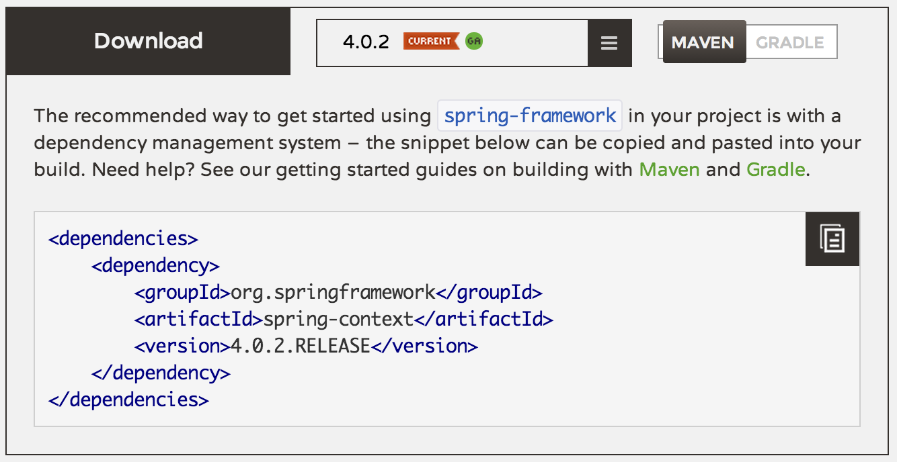
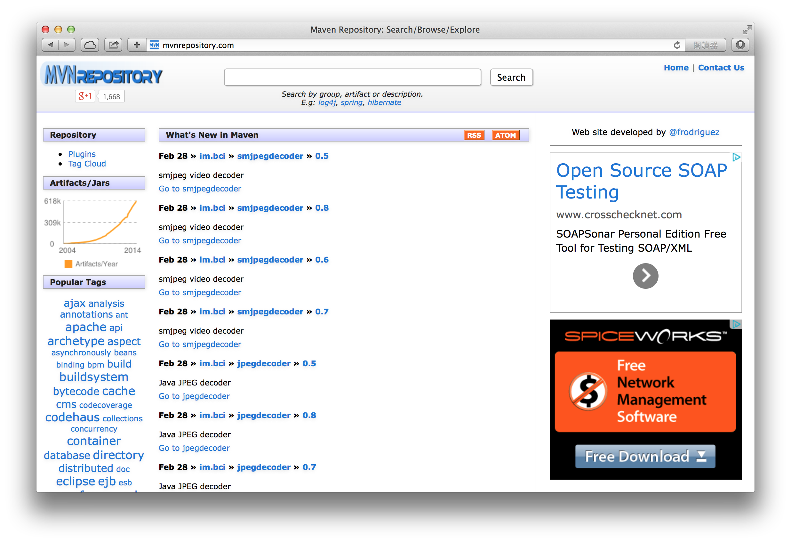
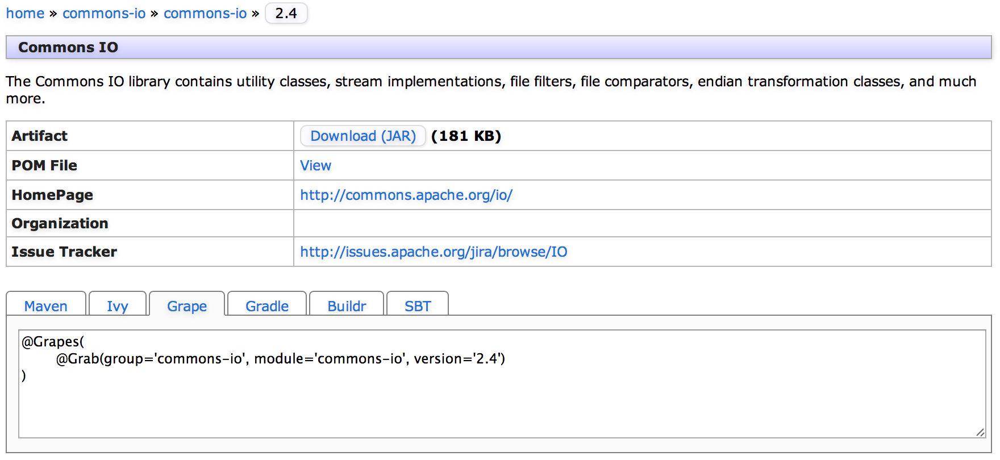
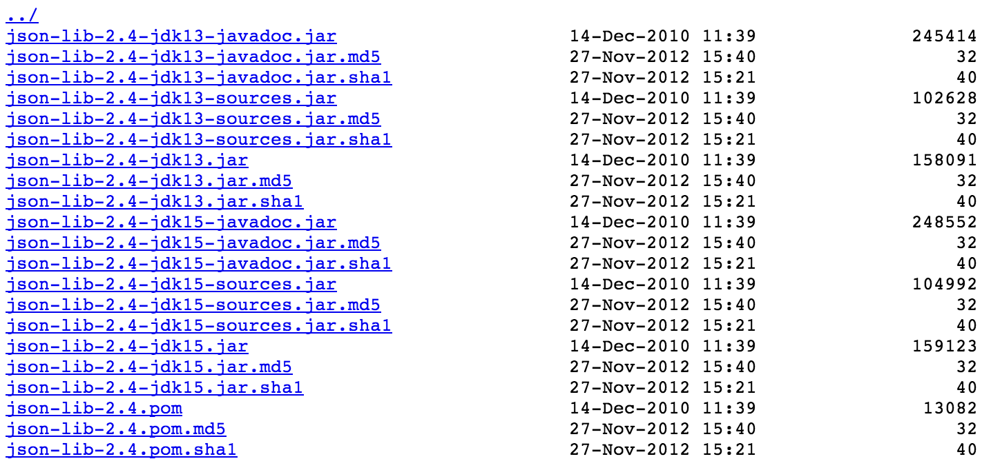
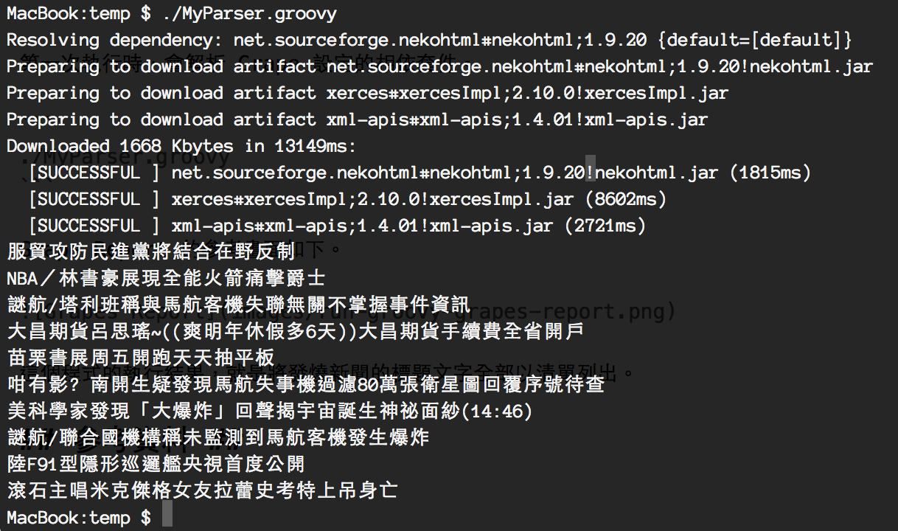

# Groovy Tutorial（4）使用 Grape 與 Grab #

[Groovy Tutorial（3）淺談 Closure 程式設計 << 前情](http://www.codedata.com.tw/java/groovy-tutorial-03-closure/)

Java 世界蘊藏豐富的各式各樣開發資源，大量可加以利用的函式庫，被封裝成 JAR 檔案發佈，幾乎能滿足各種應用開發的基礎需求。

撰寫 Groovy 程式時，我們可以撰寫比 Java 更簡潔的程式碼，看起來更像那些現代化程式語言。許多新興程式語言雖然熱門，但是開發應用所需的 Library 非常缺乏，以至於經常需要重新造輪子；Groovy 開發者幸運得多，因為發展久遠且受到大型企業愛用的 Java 累積豐富的資源，在 Groovy 程式能直接加以利用。

大部份 Java 開放原始碼的專案，都可以在 Maven Repository 找到最新版本的 JAR 檔案。而 Groovy 提供 Grape 功能，讓開發者方便從 Repository 取得所需套件，只要輕鬆撰寫 Groovy Script 就能完成許多任務。

## 認識 Maven Repository ##

Maven 是 Java 的自動化建置工具，可以編譯 Java 原始程式、把專案封裝成 JAR 檔案，更重要的是，它提供相依性管理（Dependency Management），並且讓 Java 社群開始建置 Open Source 函式庫的 Repository。Maven Repository 是保存函式庫 JAR 檔案的倉庫，大多常見的 Java 開放源碼函式庫，都可以從網路上公開的 Maven Repository 取得已經打包的 JAR 檔案。

有不少開源的 Java 函式庫透過 Maven Repository 發佈，例如下圖是 Spring Framework 專案的網頁內容，它沒有提供檔案下載的連結，而是提供一段 Maven 或 Gradle 的 Dependency 設定範例。



只要有以下三項參數資訊，就可以從 Maven Repository 取得所需要的 JAR 檔案。

1. `groupId` （例如：commons-io）
2. `artifactId` （例如：commons-io）
3. `version` （例如：2.4）

目前有不少 Open Source 組織架設 Maven Repository 的伺服器，例如：

* http://repo.maven.apache.org/maven2/

Repository 伺服器使用 HTTP(S) 協定提供檔案，標準的路徑結構格式為：

`[groupId]/[artifactId]/[artifactId]-[version].jar`

因此取得 JAR 檔案的 URL 來源是：

`http://repo.maven.apache.org/maven2/commons-io/commons-io/2.4/commons-io-2.4.jar`

實際上 Dependency Management 的運作比上述更複雜，Maven 使用「POM（Project Object Model）」設定專案組態，解析 Dependency 需要先從 Repository 伺服器取得 pom.xml 的組態檔，才能獲取正確的 JAR 檔案下載位址。

Groovy 開發者並不需要瞭解太多有關 Maven 的細節，未來如有專案自動化建置的需求，可以考慮學習更多 Groovy 開發者偏好的 Gradle 工具。到目前為止，我們只需要知道，許多公開的 Maven Repository 提供大量 Java Library，撰寫 Groovy 程式時，可以方便地取用這些 JAR 資源。

## 使用 Grape 指令工具 ##

Groovy 提供「`grape`」的 command-line 指令工具，可以用於 Dependency Libraries（亦稱為 grapes）的管理。

執行 `grape --help` 可以看到 `grape` 提供的指令用法。

* install      Installs a particular grape
* uninstall    Uninstalls a particular grape (non-transitively removes the respective jar file from the grape cache)
* list         Lists all installed grapes
* resolve      Enumerates the jars used by a grape

使用 Grape 安裝套件時，需要以下三個參數，基本上與 Maven 的用法一致，但是在 Groovy 我們慣用 module 而非 artifact 來稱呼套件名稱。

* group （Maven 的 groupId）
* module （Maven 的 artifactId）
* version

安裝新套件至少需要兩個參數，依序是 group 與 module，如此才能完整辨識一個套件；若不指定 version 參數，就會取得最新版本。以下是安裝新套件的指令範例：

* `grape install commons-io commons-io`
* `grape install commons-io commons-io 1.0`

使用 `grape list` 可以查詢哪些套件已被安裝，以及有哪些已安裝的版本。

* `commons-codec commons-codec  [1.6]`
* `commons-collections commons-collections  [3.2.1]`
* `commons-io commons-io  [1.0, 2.2]`
* `commons-logging commons-logging  [1.1.1, 1.1.3]`

如果需要移除，使用 `uninstall` 指令，需要明確指定移除的版本代碼。

* `gradle uninstall commons-io commons-io 1.0`

已安裝過的套件（Grapes），會儲存在 `.groovy` 的路徑，日後可以重複使用不需要重新安裝，除非該套件有新版本需要升級。

`$HOME/.groovy/grapes/`

以 Commons IO 1.0 為例，在以下的路徑可以找到 Grape 快取的 JAR 檔案。

`$HOME/.groovy/grapes/commons-io/commons-io/jars/commons-io-1.0.jar`

## 搜尋 Maven Repository ##

mvnrepository.com 網站提供 Maven Repository 搜尋功能，只要輸入 Group 或 Module 名稱，就可以找到符合搜尋關鍵字條件的相關套件。



以搜尋「commons-io」的結果為例，可以找到最新版本目前是 `2.4`，在詳細檢視中，可以看到 Maven 及 Grape 的設定範例。



有些開發工具（如 IntelliJ IDEA）也提供 Maven Repository 的整合，可以方便找到需要的套件。

在撰寫 Groovy Script 時，若用到一些 JDK 沒有的功能，而需要使用 3rd Party Libraries，可以先用 Google 搜尋關鍵字，找到函式庫的專案名稱後，再到 MVNRepository 尋找所需的相依性設定。

有些 Library 的搜尋結果，會出現重複的 Repository，例如搜尋 `commons-io` 會找到兩個 artifactId 相同、但是 groupId 不同的結果：

* commons-io » commons-io
* org.apache.commons » commons-io

以這個情況來說，需要到 [commons-io](http://commons.apache.org/proper/commons-io/) 的專案主頁，查看最新正式發佈的版本編號，對照即可發現 commons-io » commons-io 已提供 2.4 版本，與官方發佈的最新版本一致。

有些開放源碼專案的網頁，會明確指示 Maven Repository 所需的 Dependency 設定，例如 Spring 所發行的相關 Library，但目前仍有很多專案缺少清楚說明，需要透過交叉比對的方式，確認使用的套件是來自原開發團隊同步發行的版本，避免使用到一些舊版或某些組織客製化的非標準版。

## 使用 Grab 設定套件相依性 ##

在 MVNRepository 的搜尋結果中，可以得到一段標準的 Grape 設定範例，例如：

```
@Grapes(
	@Grab(group='commons-io', module='commons-io', version='2.4')
)
```

有這段設定，就可以在 Groovy Script 使用 `commons-io` 套件提供的 API 功能。

以下的範例使用 `org.apache.commons.io.FilenameUtils` 類別提供的檔名處理函式，在 Groovy Script 的最上方使用 `@Grapes` / `@Grab` 設定此程式相依的函式庫，就可以 `import` 套件提供的類別 API 功能。

```
@Grapes(
    @Grab(group='commons-io', module='commons-io', version='2.4')
)
import org.apache.commons.io.FilenameUtils

def path = 'C:\\Temp\\Hello.txt'

println FilenameUtils.getName(path)
println FilenameUtils.getBaseName(path)
println FilenameUtils.getExtension(path)
```

第一次執行此 Script 時，Groovy 會解析程式碼的 @Grab 設定，自動下載所需要的 JAR 檔案，並儲存在 `~/.groovy/grapes/` 資料夾中，所以會等待一段較長的時間。如果套件的版本不變，日後會直接使用已下載的快取檔案，執行程式的等待時間就會大幅縮短。

對於 Groovy 開發者來說，並不需要先用 `grape` 指令安裝套件，直接在程式碼加上 `@Grab` 即可。通常只有在需要檢視或移除已安裝的套件，才會使用 `grape list` 或 `grape uninstall` 指令。

`@Grab` 的功能讓 Groovy Script 的撰寫更方便，不再需要事先下載相依的 JAR 檔案，也不再需要設定 CLASSPATH；只要在 Script 中宣告所需的套件及版本，就可以確保程式中 `import` 所需的 Library 皆已備妥。

在這個範例中，我們可以省略 `@Grapes` 的宣告，只留下 `@Grab` 的設定，以下是更加簡化的程式碼寫法。

```
@Grab(group='commons-io', module='commons-io', version='2.4')
import org.apache.commons.io.FilenameUtils

// skip...
```

再省略 group、module 及 version 的參數名稱，最簡化的 @Grab 宣告寫法如下。

```
@Grab('commons-io:commons-io:2.4')
import org.apache.commons.io.FilenameUtils
```

## 關於 version 的設定 ##

如果不指定版本，或者將版本設定為「`*`」符號，Grape 會直接使用任何一個已經安裝過的版本；如果從未安裝過此套件的任何版本，就會自動選擇最新的版本。

```
@Grab('commons-io:commons-io:')
```

或

```
@Grab('commons-io:commons-io:*')
```

Grape 亦支援 Apache Ivy 的 [version ranger](https://ant.apache.org/ivy/history/2.1.0/settings/version-matchers.html) 設定方式，讓我們可以指定「某個版本以上」或「符合指定範圍的版本」。

```
//2.4
@Grab('commons-io:commons-io:2+')

//2.0.1
@Grab('commons-io:commons-io:2.0+')

//greater or equal to 1.0
@Grab('commons-io:commons-io:[1.0,)')

//lower or equal to 2.3
@Grab('commons-io:commons-io:(,2.3]')
```

## 顯示 Grape 下載進度 ##

在 GroovyConsole 中執行 Groovy 程式時，如果第一次使用某些套件，會在下方狀態列顯示 Grape 的套件下載進度。

如果在 Terminal 直接以 command-line 方式執行 Groovy 程式，預設並不會顯示 Grape 的下載進度，然而，沒有任何訊息輸出，容易讓開發者自己也不清楚程式執行到哪。設定 System Property 可以打開 Grape 的除錯功能，「`groovy.grape.report.downloads=true`」顯示詳細的相依性解析與下載進度。

```
groovy -Dgroovy.grape.report.downloads=true ProgramName.groovy
```

如果想要把這組設定套用到每一次的執行，可以設定 JAVA_OPTS 環境變數。

```
export JAVA_OPTS=-Dgroovy.grape.report.downloads=true
```

## 設定 Repository 來源 ##

Grape 提供預設的 Central Maven Repository 設定，因此常用的 Open Source Java Library 大多可以順利自動下載。但是也有一些 Library 並未發佈到 Central Repository 站台，就需要自行設定 Repository 的來源，使用的語法是 `@GrabResolver` 設定。

```
@GrabResolver(name='restlet.org', root='http://maven.restlet.org/')
@Grab(group='org.restlet', module='org.restlet', version='1.1.9')
```

Java Open Source 專案的開發者，可以利用 Maven（pom.xml）或 Gradle 工具，把打包的 JAR 檔案發佈到免費的 [Central Repository](http://central.sonatype.org/)，就能夠輕鬆在 Groovy Script 中使用 Grape 利用自行開發的 Library。

使用 Java 開發商業軟體的團隊，通常建議自行架設維護私有的 Repository，[Sonatype Nexus](http://www.sonatype.org/nexus/) 提供免費的 OSS 與商業的 PRO 版本，是目前架設 Maven Repository Server 最常見的伺服器軟體。

對於現代的 Java 專案開發，實務上我們會這麼做：需要被重複共用的 Component 獨立成新專案或子專案，使用 Maven 或 Gradle 進行自動化建置，再搭配 Jenkins CI 持續整合，最後將通過 Test 的產出（JAR 檔案）發佈到 Nexus Repository。

通常一個有些規模的 Java 專案，會使用到很多自行開發的封裝元件（JAR），Groovy Script 使用 Grape 存取 Maven Repository 的功能，帶給開發團隊很多好處：更容易測試這些獨立的元件，只要撰寫很簡單的 Script 程式碼，就能示範這些自行開發的元件如何使用，也能輕鬆使用 Script 方式來維護 Java 開發的系統。

## @Grab 的 classfier 設定 ##

Maven 提供 classfier 設定，可以將 artifact 進一步分類，在專案中常見的 classfier 有 `sources` 與 `javadoc` 兩種。

通常在使用 Grape 時，並不需要特別設定 `classfier` 參數。只有一種情況例外，就是當某個套件需要依不同 JDK 版本做區分時，就需要加上 classfier 的設定。

例如 [json-lib](http://repo1.maven.org/maven2/net/sf/json-lib/json-lib/2.4/) 的 Maven Repository 資料夾，可以清楚看到 JAR 檔案的版本代碼後方，還有 `jdk13` 與 `jdk15` 的額外檔案名稱。



因為 json-lib 針對舊版 JDK 1.3 與新版的 JDK 1.5 以上版本，分別提供不同的 JAR 檔案，此時就以 classfier 作為區分不同檔案之用。

以 JDK 1.7（1.5 以上版本）為例，使用 json-lib 則設定「`classfier='jdk15'`」，以下是 `@Grab` 的宣告範例。

```
@Grab(group='net.sf.json-lib', module='json-lib', version='2.4', classifier='jdk15')
```

## 關於 @GrabExclude 與 @GrabConfig 設定 ##

Grapes 賦予 Groovy 自動化的 Dependency Management 機制，當我們從 Maven Repository 取得一個 Artifact 時，其相依的其他 Artifact 也會一併被使用。使用 `grape` 工具的 `resolve` 指令，可以查詢一個 Artifact 有哪些其他相依的套件。

例如 xalan 2.7.1 就依賴 xml-apis 這個套件。

```
$ grape resolve xalan xalan 2.7.1
.groovy/grapes/xalan/xalan/jars/xalan-2.7.1.jar
.groovy/grapes/xalan/serializer/jars/serializer-2.7.1.jar
.groovy/grapes/xml-apis/xml-apis/jars/xml-apis-1.3.04.jar
```

如果程式用到的 A 套件，相依 B 與 C 套件；但是我們想把 C 套件排除，若很明確清楚需要這麼做，則可以用 `@GrabExclude` 設定。

以下是使用 xalan 但排除 xml-apis 的設定範例。

```
@Grapes([
  @Grab('xalan:xalan:2.7.1'),
  @GrabExclude('xml-apis:xml-apis')
])
```

另一個開發者需要知道的 Grape 設定，就是 `@GrabConfig` 的類別載入器（[ClassLoader](http://openhome.cc/Gossip/JavaGossip-V2/IntroduceClassLoader.htm) ）參數，它有 `systemClassLoader` 與 `initContextClassLoader` 兩個 boolean 值的設定。

> systemClassLoader
>
> Set to true if you want to use the system classloader when loading the grape. This is normally only required when a core Java class needs to reference the grabbed classes, e.g. for a database driver accessed using DriverManager.
>
> initContextClassLoader
>
> Set to true if you want the context classloader to be initialised to the classloader of the current class or script. This is useful for libraries or frameworks that assume that the context classloader has been set. But be careful when using this flag as your script or class might behave differently when called directly (from the command line or from an IDE) versus when called from within a container, e.g. a web container or a JEE container.

最常見需要設定 `@GrabConfig` 的情況，就是在使用 JDBC 存取資料庫時。我們通常不會用 `import` 取得資料庫驅動的類別，如果要取得 MySQL JDBC Driver 的 instance 常見的做法是：

```
Class.forName("com.mysql.jdbc.Driver").newInstance();
```

我們可以在外部設定檔（.properties）配置資料庫連線參數，包含使用哪一種資料庫驅動程式。使用 JDBC 的 DriverManager 可以動態建立連線物件，不僅連線字串（connection string）可以修改，資料庫驅動程式的名稱（例如 `com.mysql.jdbc.Driver`）也可透過設定來變更。

```
Connection conn = null;
conn = DriverManager.getConnection("jdbc:mysql://...");
```

下列是幾種常見的資料庫驅動程式：

* org.hsqldb:hsqldb:2.3.2
* mysql:mysql-connector-java:5.1.29
* net.sourceforge.jtds:jtds:1.3.1

為了確保資料庫驅動程式的類別，我們需要在系統層級的 ClassLoader 使用 Grape，以下是搭配 MySQL Connector/J 驅動程式的 Grape 使用範例，在 `@GrabConfig` 設定 `systemClassLoader=true` 參數，如此才能讓 `Class.forName` 正常操作。

```
@Grapes([
  @Grab('mysql:mysql-connector-java:5.1.29'),
  @GrabConfig(systemClassLoader=true, initContextClassLoader=true)
])
import groovy.sql.Sql

def sql=Sql.newInstance("jdbc:mysql://localhost/test", "root", "", "com.mysql.jdbc.Driver")
println sql.firstRow('SELECT * FROM INFORMATION_SCHEMA.COLUMNS')
```

如果沒有加上 `systemClassLoader=true` 的設定，就會發生「No suitable driver found」的錯誤。

```
Caught: java.sql.SQLException: No suitable driver found for jdbc:mysql://localhost/test
java.sql.SQLException: No suitable driver found for jdbc:mysql://localhost/test
	at RunSQL.run(RunSQL.groovy:4)
```

`@Grapes` 區塊的設定，可以再加以簡化，只留下 `@Grab` 與 `@GrabConfig` 的語法部分。

```
@Grab('mysql:mysql-connector-java:5.1.29')
@GrabConfig(systemClassLoader=true, initContextClassLoader=true)
```

## Groovy Script 的應用 ##

認識 Grape 的使用方法，是撰寫 Groovy Script 的基礎。當我們利用 Scripting Language 完成一些任務時，總是希望它能夠容易撰寫、修改及執行，只要一個 Script 檔案就能執行，而不需要在資料夾存放其他如專案配置或函式庫檔案。

在 Unix-like 系統下（如 Linux 或 Mac OS X），Groovy 程式可以使用類似 Shell Script 的方式執行。Java 及 Groovy 的開發者，可以用自己較熟悉的語言，撰寫常用或用完即丟的 Script 程式；使用傳統的 Java 專案來做這件事情，感覺像是用牛刀殺雞，相較之下 Groovy 是更好的選擇。

```
#!/usr/bin/env groovy
println("Hello world")
for (a in this.args) {
  println("arg: " + a)
}
```

從實際應用的案例來說明，我們製作一個範例程式，使用 CyberNeko HTML Parser（簡稱 NekoHTML）解析網頁原始碼內容；NekoHTML 可以將 HTML 解析成 DOM 或 SAX 的結構，方便我們搜尋特定的節點、取得屬性及內容資料。

先從 NekoHTML 專案的官方網站，瞭解最新版本的編號，這有助於我們在 Maven Repository 挑選合適的來源及版本。

* [NekoHTML](http://nekohtml.sourceforge.net/) 最新版為 1.9.20

從 [MVNRepository](http://mvnrepository.com/) 搜尋需要的套件名稱，挑選最新的發行版本，可以獲得以下的 `@Grab` 參考設定。

```
@Grab('net.sourceforge.nekohtml:nekohtml:1.9.20')
```

範例程式的主要功能是從  網頁右下方的「發燒新聞」，取得每個新聞標題文字。

`MyParser.groovy` 範例程式碼。

```
#!/usr/bin/env groovy
@Grab('net.sourceforge.nekohtml:nekohtml:1.9.20')
import org.cyberneko.html.parsers.SAXParser

def url = 'https://news.google.com.tw/nwshp?hl=zh-TW&tab=wn'

def parser = new SAXParser()
parser.setFeature('http://xml.org/sax/features/namespaces', false)

def page = new XmlParser(parser).parse(url)

def data = page.depthFirst().DIV.grep {
  it.'@class'=='title'
}

data.each {
  println it.A.SPAN.text()
}
```

先幫 MyParser.groovy 打開執行權限（適用 Unix-like 系統）。

```
chmod a+x MyParser.groovy
```

第一次執行時，會解析 Grape 設定的相依套件。

```
./MyParser.groovy
```

執行結果的參考畫面如下。



這支程式讀取 Google News 首頁的 HTML 原始碼，利用 NekoHTML 的 `SAXParser` 解析，搭配 Groovy 的 `grep` 方法，找出每一條發燒新聞的標題。

使用 Groovy 撰寫 Script 程式，可以搭配 Crontab 排程執行、利用 Shell 的 pipeline 與其他 command-line 工具併用。對於 Java 開發者來說，有許多系統維護的小程式，都可以利用 Groovy Script 開發，已經開發好的 Java Library 能被直接使用，加上 Groovy 更簡潔易寫的語法，可以用更短的時間輕鬆達成任務。
